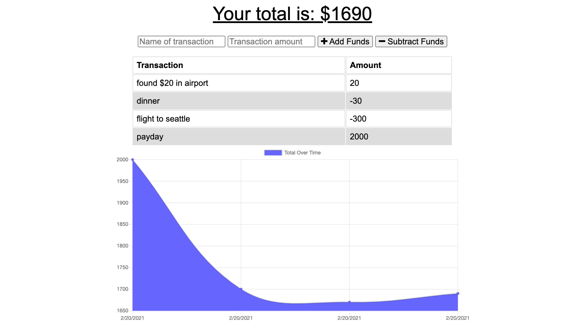

  # BudgetTrak (Budget Tracker)

  ## Description
  BudgetTrak is a PWA that gives users a fast and easy way to track their money. This application allows for offline access and functionality so that the user will be able to add expenses and deposits to their budget with or without an internet connection. If the user enters transactions offline, the total should be updated when they're brought back online.

  ## Table Of Contents
  * [Usage](#usage)
  * [Contribution](#contribution)
  * [Questions](#questions)

  ## Usage
  Please download the files located in this [repository](https://github.com/kristinmoon/budget-tracker) to utilize or edit this application. A deployed version of the application can also be found at https://murmuring-depths-29548.herokuapp.com/, where you can install the PWA onto your computer or mobile device via the browser.
  
  Get a feel for the application in the below screenshot. 
  

  ## Contribution
  I always welcome any suggestions you may have to improve my projects' functionality. Please see below for how to contact me.

  ## Questions
  Please contact me at [kristin@icloud.com](mailto:kristin@icloud.com) with any questions. You can also find me on GitHub, username [kristinmoon](https://github.com/kristinmoon).
